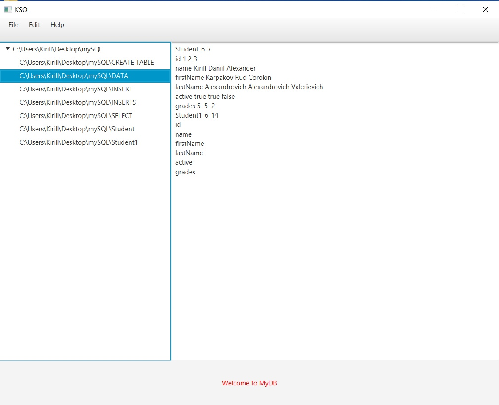

 # MyOwnDB
> ## Ptoject for university 

This is a prototype of my own database written in Java using the JavaFX platform.Data is stored in the working directory. 

Some T-SQL functions are implemented (CREATE TABLE/DATABASE, SELECT, INSERT). The lexer reads commands from the work field. 

The data of the table fields are stored in a file with a special architecture, as a rule, the first line consists of the name of the table, the number of fields and the row number with the data of the following table

